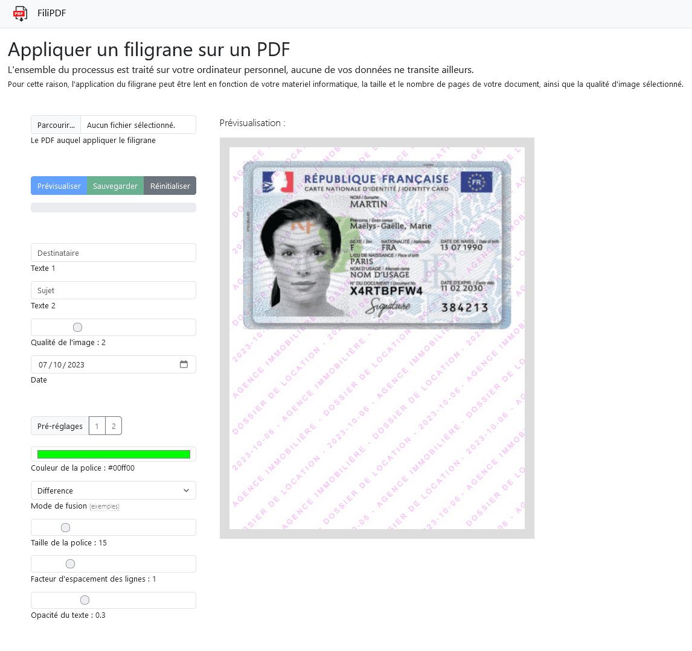

# FiliPDF

FiliPDF est une application web pour appliquer un filigrane sur les pages d'un PDF.

- Les pages sont fusionnées pour empécher d'éditer le PDF pour supprimer manuellement le filigrane;
- FiliPDF est serverless, tout est géré en local.

