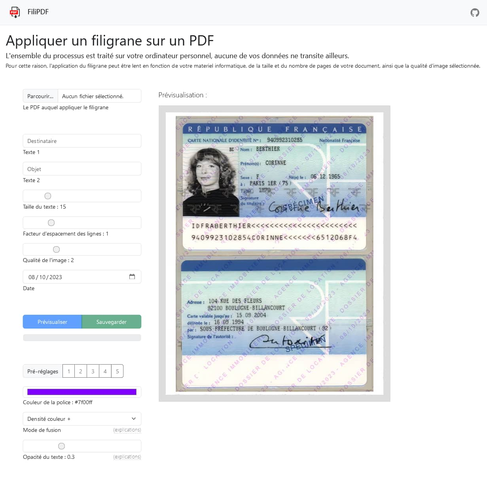

# FiliPDF 

### FiliPDF est une application web qui permet d'ajouter un filigrane aux pages d'un fichier PDF.

- Chaque page est convertie en image pour prévenir toute tentative d'édition du PDF visant à supprimer manuellement la couche contenant le filigrane ;
- FiliPDF fonctionne en toute autonomie sur l'ordinateur local, sans nécessiter de connexion à un serveur. Par conséquent, aucune donnée n'est transférée vers l'extérieur ;
- Diverses options sont proposées, notamment la possibilité de régler l'opacité du texte, afin de [réduire au maximum l'efficacité](options/opacity.md) des intelligences artificielles chargées de supprimer les filigranes.

