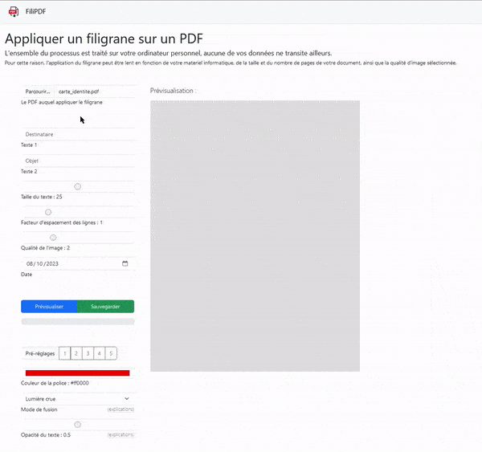

#  FiliPDF - Web app ajouter un filigrane à un fichier PDF

## PRÉSENTATION
Cette page web statique opère en autonomie totale sur l'ordinateur local, sans nécessiter de connexion à un quelconque serveur, ce qui garantit la confidentialité des documents manipulées.  

Les dépendances sont directement intégrées afin de prévenir tout suivi éventuel du trafic ou des utilisateurs.  

&#160;

## CARACTÉRISTIQUES
- Chaque page est convertie en image pour prévenir toute tentative d'édition du PDF visant à supprimer manuellement la couche contenant le filigrane ;
- Diverses options sont proposées, notamment la possibilité de régler l'opacité du texte, afin de [réduire au maximum l'efficacité](options/opacity.md) des intelligences artificielles chargées de supprimer les filigranes ;
- Les PDF avec des pages de tailles variables [sont pris en charge](features/multiplesize.md) ;
- Les alphabets latin, greek et cyrillic [sont pris en charge](features/glyphs.md).

&#160;

## DÉPENDANCES
- Bootstrap (5.3.2)
- JQuery (3.3.1)
- PdfLib (1.17.1)
- PdfJs (3.11.174)
- Fontkit (1.1.1)
- Noto Latin, Greek, Cyrillic (2.013)
