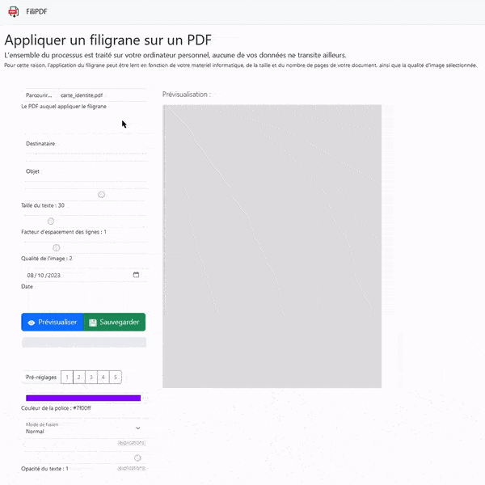

#  FiliPDF - Web app pour ajouter un filigrane à un PDF

## PRÉSENTATION
Cette page web statique opère en autonomie totale sur l'ordinateur local, sans nécessiter de connexion à un quelconque serveur, ce qui garantit la confidentialité des documents manipulées.  

Les dépendances sont directement intégrées afin de prévenir tout suivi éventuel du trafic ou des utilisateurs.  

> [!NOTE]  
> Il est possible de [télécharger la dernière version de FiliPDF](https://github.com/PhilJbt/FiliPDF/releases/latest/download/FiliPDF.zip) et de la lancer sur son propre ordinateur.

&#160;

## CARACTÉRISTIQUES
- Chaque page est convertie en image pour prévenir toute tentative d'édition du PDF visant à supprimer manuellement la couche contenant le filigrane ;
- Diverses options sont proposées, notamment la possibilité de régler l'opacité du texte, afin de [réduire au maximum l'efficacité](options/opacity.md) des intelligences artificielles chargées de supprimer les filigranes ;
- Les PDF avec des pages de tailles variables [sont pris en charge](features/multiplesize.md) ;
- Les alphabets latin, grec et cyrillic [sont pris en charge](features/glyphs.md).

&#160;

## DÉPENDANCES
- Bootstrap (5.3.2)
- jQuery (3.3.1)
- PDFLib (1.17.1)
- PDF.js (3.11.174)
- fontkit (1.1.1)
- Noto Latin, Greek, Cyrillic (2.013)
