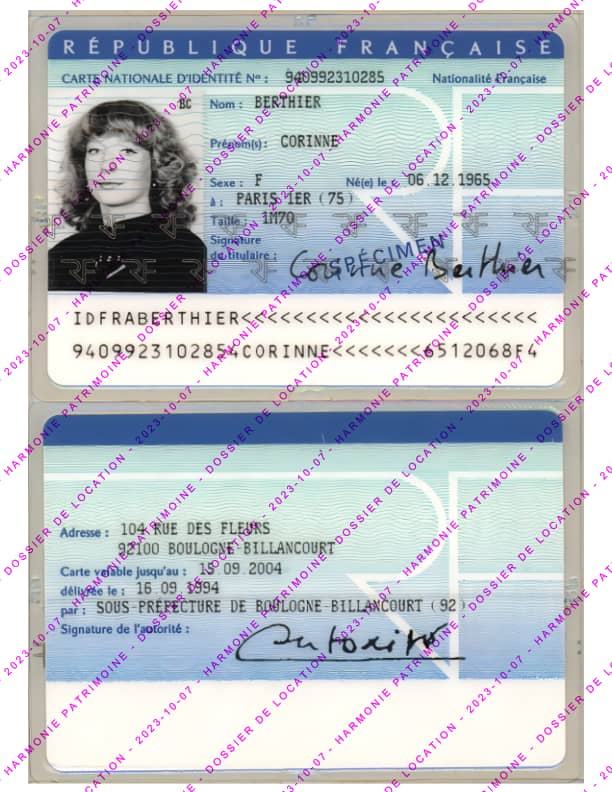
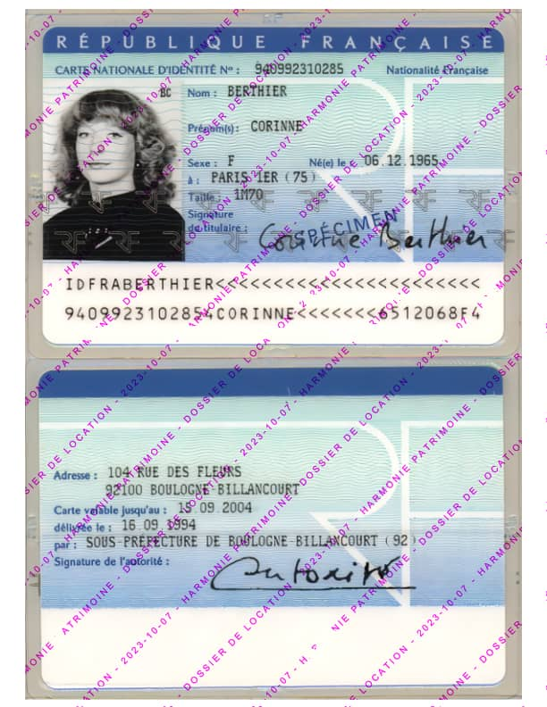
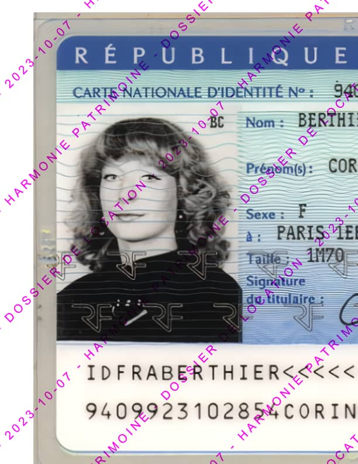
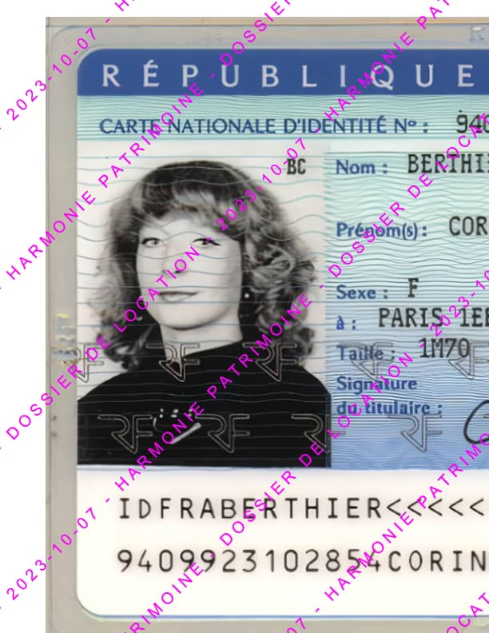

# FiliPDF - Modes de fusion / Blend modes

### Normal  
&#127467;&#127479; Aucun mélange, la couleur de fusion est appliquée par dessus la couleur de base.  
&#127482;&#127480; No mixing, the fusion color is applied onto the base color.

***

### Différence  
&#127467;&#127479; Soustrait la couleur de fusion de la couleur de base, produisant un effet de contraste élevé.  
### Difference  
&#127482;&#127480; Subtracts the blend color from the base color, producing a high-contrast effect.

***

### Exclusion  
&#127467;&#127479; Similaire à "Différence", mais avec un contraste moins intense.  
&#127482;&#127480; Similar to "Difference," but with a less intense contrast.

***

### Produit  
&#127467;&#127479; Assombrit la couleur de base en la multipliant avec la couleur de fusion.  
### Multiply  
&#127482;&#127480; Darkens the base color by multiplying it with the blend color.

***

### Incrustation  
&#127467;&#127479; Combine les couleurs de base et de fusion pour augmenter le contraste et la saturation.  
### Overlay  
&#127482;&#127480; Combines the base and blend colors to increase contrast and saturation.

***

### Superposition  
&#127467;&#127479; Éclaircit la couleur de base en l'inversant et en la multipliant avec la couleur de fusion inversée.  
### Screen  
&#127482;&#127480; Lightens the base color by inverting and multiplying it with the inverted blend color.

***

### Densité couleur +  
&#127467;&#127479; Assombrit la couleur de base en augmentant le contraste avec la couleur de fusion.  
### Color Burn  
&#127482;&#127480; Darkens the base color by increasing the contrast with the blend color.

***

### Densité couleur -  
&#127467;&#127479; Éclaircit la couleur de base en diminuant le contraste avec la couleur de fusion.  
### Color Dodge  
&#127482;&#127480; Lightens the base color by decreasing the contrast with the blend color.

***

### Obscurcir  
&#127467;&#127479; Sélectionne la couleur la plus foncée entre la couleur de base et la couleur de fusion.  
### Darken  
&#127482;&#127480; Selects the darker color between the base and blend colors.

***

### Lumière crue  
&#127467;&#127479; Combine les couleurs de base et de fusion en mettant l'accent sur les tons clairs et foncés de la couleur de fusion.  
### Hard Light  
&#127482;&#127480; Combines the base and blend colors with a strong emphasis on the blend color's highlights and shadows.

***

### Eclaircir  
&#127467;&#127479; Sélectionne la couleur la plus claire entre la couleur de base et la couleur de fusion.  
### Lighten  
&#127482;&#127480; Selects the lighter color between the base and blend colors.

***

### Lumière tamisée  
&#127467;&#127479; Mélange les couleurs de base et de fusion en préservant les tons moyens et en renforçant le contraste.  
### Soft Light  
&#127482;&#127480; Softly blends the base and blend colors, preserving midtones and enhancing contrast.

