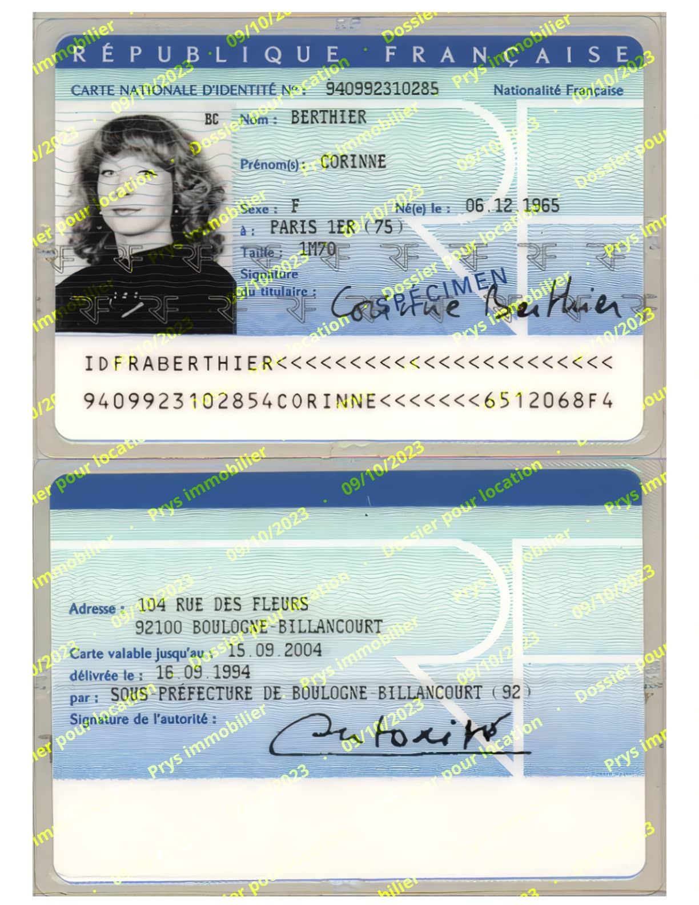
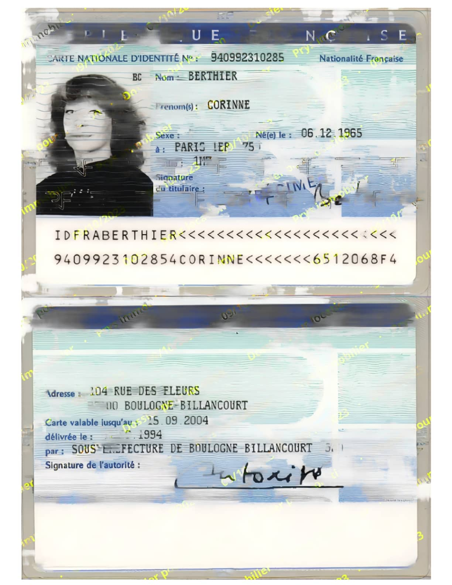

# FiliPDF - Opacité / Opacity

### Opacité  
&#127467;&#127479; Configurer une légère opacité du texte rend plus difficile la suppression du filigrane par des intelligences artificielles sans entraîner une forte dégradation du document, rendant le document difficile à accepter par la partie réceptrice. 
### Opacity  
&#127482;&#127480; Configuring a slight text opacity makes it more difficult for artificial intelligences to remove the watermark without causing severe document degradation, making the document difficult to accept by the receiving party.

Original:  
  

Resultat / Result  
